# WFP Traffic Control System - Architecture Diagrams

This file contains Mermaid diagrams that can be:
- Previewed in VS Code with the "Mermaid Preview" extension
- Converted to images at https://mermaid.live
- Embedded directly in GitHub/Azure DevOps markdown
- Used in documentation tools (Sphinx, MkDocs, Docusaurus)

---

## 1. High-Level Architecture


---

## 2. Policy Apply Flow (Sequence Diagram)


---

## 3. Component Dependencies


---

## 4. Idempotent Reconciliation Process


---

## 5. Safety Mechanisms

```mermaid
graph TD
    subgraph Mechanisms["Safety Mechanisms"]
        direction TB

        S1[🔒 Transactional Updates<br/>WfpTransaction RAII<br/>All-or-nothing commits]

        S2[🛡️ Fail-Open Behavior<br/>LKG corrupt → allow all<br/>Apply fails → keep existing]

        S3[🚨 Panic Rollback<br/>wfpctl rollback<br/>Delete all filters instantly]

        S4[💾 LKG Recovery<br/>SHA256 integrity<br/>wfpctl lkg revert]

        S5[🔄 Idempotent Apply<br/>Same input → zero changes<br/>Deterministic GUIDs]

        S6[🔍 Input Validation<br/>Schema checks<br/>Path traversal protection<br/>Rate limiting]
    end

    Policy[Policy Apply Request] --> S6
    S6 --> S2
    S2 --> S5
    S5 --> S1
    S1 --> WFP[Windows Filtering Platform]

    Error[Error/Failure] --> S3
    Error --> S4
    S3 --> WFP
    S4 --> WFP

    WFP --> Network[Network Stack<br/>Connection Enforcement]

    style Mechanisms fill:#fff4e1
    style WFP fill:#ffe1e1
    style Network fill:#e1ffe1
```



---

## 6. Security Layers (Defense in Depth)


---

## 7. Data Flow: User Space to Kernel Space


---

## Converting Diagrams to Images

### Method 1: Online (Easiest)
1. Go to https://mermaid.live
2. Paste any diagram code from above
3. Click "Download PNG" or "Download SVG"

### Method 2: VS Code
1. Install extension: "Mermaid Preview" or "Markdown Preview Mermaid Support"
2. Open this file in VS Code
3. Right-click diagram → "Export to PNG/SVG"

### Method 3: Command Line
```bash
# Install mermaid-cli
npm install -g @mermaid-js/mermaid-cli

# Convert to PNG
mmdc -i ARCHITECTURE_DIAGRAMS.md -o architecture.png

# Convert to SVG
mmdc -i ARCHITECTURE_DIAGRAMS.md -o architecture.svg
```

### Method 4: Python
```bash
pip install mermaid-py
python -c "from mermaid import Mermaid; Mermaid('diagram.mmd').to_png('output.png')"
```

---

## Using in Documentation

### GitHub Markdown
Just paste the mermaid code blocks directly - GitHub renders them automatically.

### Azure DevOps Wiki
Paste the mermaid code blocks - Azure DevOps supports Mermaid natively.

### Confluence
Use the "Mermaid Diagrams" app from Atlassian Marketplace.

### PowerPoint/Word
1. Export as PNG/SVG using methods above
2. Insert as image

### Sphinx Documentation
Add `sphinxcontrib-mermaid` extension to conf.py.

### MkDocs
Add `pymdown-extensions` to mkdocs.yml.
